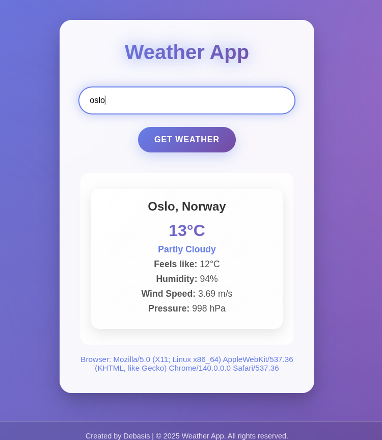

# Weather App



A modern, responsive weather application deployed on Netlify using serverless functions for secure API key handling. Features a beautiful UI with glassmorphism effects, animations, and real-time weather data.

## Features

- 🌤️ Real-time weather data from WeatherAPI.com
- 🎨 Modern glassmorphism UI with gradient backgrounds
- 📱 Fully responsive design for desktop and mobile
- ✨ Smooth animations and hover effects
- 🔒 Secure API key handling via  environment variables
- 🚀 Loading states and error handling
- ⌨️ Keyboard support (Enter key to search)

## Tech Stack

- **Frontend**: HTML5, CSS3, JavaScript
- **Backend**: Netlify Functions (Node.js)
- **API**: WeatherAPI.com
- **Security**: environment variables


## Project Structure

```
weather-app/
├── netlify/
│   └── functions/
│       └── weather.js          serverless function (API proxy)
├── public/
│   ├── index.html         # Main HTML file
│   ├── styles.css         # CSS with modern animations
│   └── script.js          # Frontend JavaScript
├── .env.example           # Example environment file
├── .gitignore             # Git ignore file
├── package.json           # Dependencies and scripts
├── README.md              # This file
└── LICENSE                # License
```

## Features in Detail

### Modern UI Design
- Glassmorphism effects with backdrop-filter
- Gradient backgrounds with animated elements
- Responsive design that works on all devices
- Smooth transitions and hover effects

### Security
- API key stored in Netlify environment variables
- Serverless function proxy to hide API key from frontend
- Input validation and error handling

### User Experience
- Loading animations during API calls
- Keyboard shortcuts (Enter to search)
- Clear error messages
- Smooth result animations

## Contributing

1. Fork the repository
2. Create a feature branch
3. Commit your changes
4. Push to the branch
5. Create a Pull Request

## License

This project is open source and available under the [MIT License](LICENSE).
